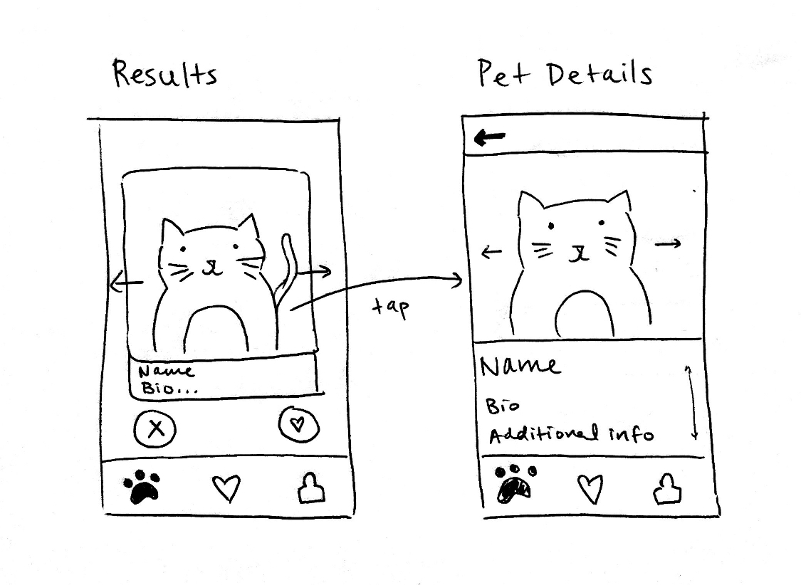
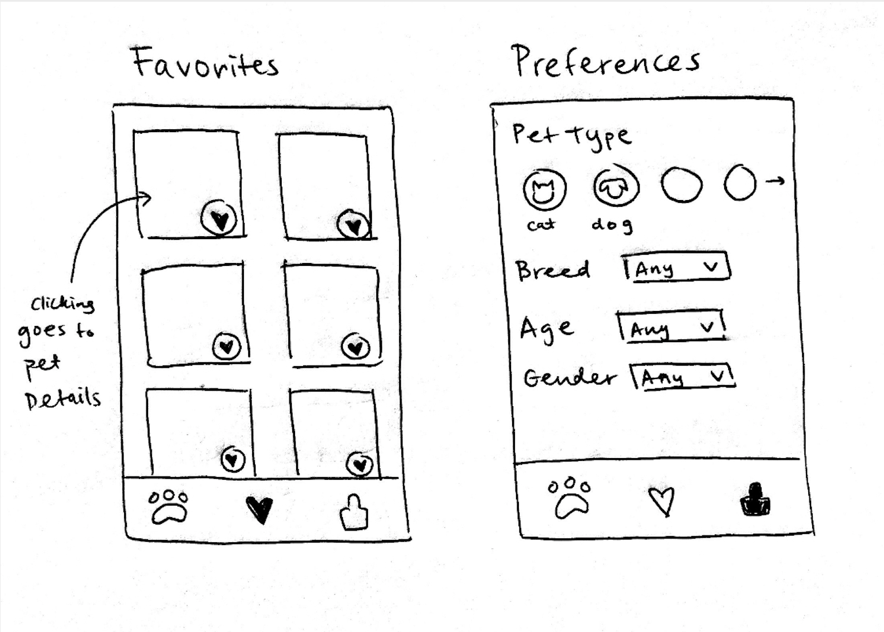

# petMatch

## Table of Contents
1. [Overview](#Overview)
1. [Product Spec](#Product-Spec)
1. [Wireframes](#Wireframes)
2. [Schema](#Schema)

## Overview
### Description
Our app is a way for people to discover adoptable pets through Tinder-style swiping.

### App Evaluation
- **Category:** Lifestyle
- **Mobile:** 
  - **Location**: Users can select pets in a specified location range based on their current location.
  - **Swiping**: Users can swipe right on pets they want to adopt and have their favorites stored.
  - **Notifications**: Users notified when there are updates with a pet they like.
- **Story:** People who are interested in adopting pets have a fun way of dicovering new pets in their area. Our friends would find this an enjoyable way to find pets.
- **Market:** Our market is large because a lot of people want to adopt pets. Our app makes this easier and more accessible. Though there are other websites and apps that exist for discovering pets, our swiping feature makes it more engaging and easy to keep track of potential pets.
- **Habit:** The ability to swipe on new pets each day makes this app addictive. Users can log in each day and get updates on potential pets. Also the liking feauture is habit-forming.
- **Scope:** We think a basic version of the app would be doable in the timeframe of 6 weeks. We mainly need to figure out how to use the PetFinder API to display information about pets, store liked pets, and implement the swiping feature. We believe we have defined our app well and have a good idea of the main features we want to implement. 

## Product Spec

### 1. User Stories (Required and Optional)

**Required Must-have Stories**

* Users can sign up for accounts and login to accounts.
* Users can input pet preferences (type, location, breed, age, etc.) that determines the set of adoptable pets they see in their search results.
* Users can swipe through their matched pets. Pets are displayed with their images, adoption bio, and adoption center information. 
* Users can swipe right on a pet from their match results and save the pet into their favorites.
* Users can swipe through unique pet matches of pets they have not already seen or viewed.
* Users can access and remove their favorited pets in a separate tab. When clicking on pet in this list, more detailed information is shown about the pet.
* Users can view pet details when clicking on pet from matches screen or favorites screen. 

**Optional Nice-to-have Stories**

* Notification updates on adopted pets (for instance, if they were adopted already) 
* "Super like" feature to save pets they are extremely interested in and prioiritize in their favorites list

### 2. Screen Archetypes
* Sign up/login screen
    * User can sign up for an account
    * User can login to their account if it exists
* Preferences screen
   * User can input preferences for pets (type, location, breed, age, etc.)
   * User can save preferences so that their search results are updated
* Swiping screen/results screen
   * Users can swipe through general information about individual pets
   * Users can swipe right on pets they want to add to their favorites
   * Users can swipe left on pets they do not want to add to their favorites
   * User sees error page if pets cannot be found for given criteria
* Favorites/Likes screen
    * User can see all the pets they've favorited
    * User can remove favorites
    * User can be redirected to 
    * User can click on a pet they've favorited to see more pet details
* Pet details page
    * User can see all the details about a pet, including adoption information
    * User can call or email the pet adoption center for specified pet

### 3. Navigation

**Tab Navigation** (Tab to Screen)

* Preferences/User Settings Tab
* Favorites Tab
* Swiping Tab

**Flow Navigation** (Screen to Screen)

* Sign up -> Preferences (with default parameters)
* Login -> Swiping (with saved parameters)
* Preferences -> Swiping
* Favorites -> pet selected -> pet information screen

## Wireframes



### [BONUS] Digital Wireframes & Mockups

### [BONUS] Interactive Prototype

## Schema 
### Models
#### User
| Property    | Type        | Description |
| ----------- | ----------- | ----------- |
| objectID    | String       |unique id for the user |
| username    | String       | username of the user |
| password    | String        | password of the user |

#### Favorited Pet
| Property    | Type        | Description |
| ----------- | ----------- | ----------- |
| objectID    | String       | unique id for the favorite (default field) |
| author    | Pointer to User| author of favorited pet |
| petID       | Number        | id of the pet that is favorited |
| imageURL    | String        | medium image URL of the pet |
| name        | String        | name of the pet |

#### User Preferences
| Property  | Type        | Description |
| --------- | ----------- | ----------- |
| objectID  | String      | unique id for the preference (default field) |
| author    | Pointer to User| author of the preferences |
| petType   | String      | type of preferred pet |
| breed     | String      | breed of preferred pet |
| size     | String       | size of preferred pet |
| age       | String      | age range of preferred pet |
| gender    | String      | gender of preferred pet |
| location  | String      | location of preferred pet |
| distance  | Number      | distance from location of preferred pet |

#### Seen Pets
| Property    | Type        | Description |
| ----------- | ----------- | ----------- |
| objectID    | String       | unique id for the favorite (default field) |
| author    | Pointer to User| author of favorited pet |
| petIDs       | Array        | list of ids of pets the user has seen |

### Networking
* Signup screen
    * (Create/POST) Create a new user
      ```
        let user = PFUser()
        
        user.username = usernameField.text
        user.password = passwordField.text
        
        user.signUpInBackground { (success, error) in
            if success {
                self.performSegue(withIdentifier: "loginSegue", sender: nil)
            }
            else {
                print("Error: \(String(describing: error?.localizedDescription))")
            }
        }
        
       ```
* Login screen
    * (Read/GET) Query user object to log in
      ```
        let username = usernameField.text!
        let password = passwordField.text!
        
        PFUser.logInWithUsername(inBackground: username, password: password){ (user, error) in
            if user != nil{
                self.performSegue(withIdentifier: "loginSegue", sender: nil)
            }
            else{
                print("Error: \(error?.localizedDescription)")
            }
        }
      ```
    
* Preferences screen
    * (Read/GET) Query user preferences of current user
      ```
        let query = PFQuery(className:"Preference")
        query.whereKey("author", equalTo:currentUser)
        query.findObjectsInBackground { (objects: [PFObject]?, error: Error?) in
            if let error = error {
                // Log details of the failure
                print(error.localizedDescription)
            } else if let objects = objects {
                // The find succeeded.
                print("Successfully retrieved \(objects.count) scores.")
                // Do something with the found objects
                for object in objects {
                    print(object.objectId as Any)
                }
            }
        }
      ```
     
    * (Update/PUT) Update preferences when changed
      ```
        let preferences = PFObject(className:"Preference")
        preferences["animal"] = animalField
        preferences["age"] = ageField
        preferences["location"] = locationField
        preferences.saveInBackground { (succeeded, error)  in
            if (succeeded) {
                // The object has been saved.
            } else {
                // There was a problem, check error.description
            }
        }
      ```
    
    * (Create/POST) Set initial preferences when user first signs up
      ```
        let preferences = PFObject(className:"Preference")
        preferences["animal"] = animalField
        preferences["age"] = ageField
        preferences["location"] = locationField
        preferences.saveInBackground { (succeeded, error)  in
            if (succeeded) {
                // The object has been saved.
            } else {
                // There was a problem, check error.description
            }
        }
      ```
    
* Swiping screen/results screen
    * (Read/GET) Query results from PetFinder API based on user preferences AND only display not already seen pets
      ```
        var url : String = "https://api.petfinder.com/v2/animals/"
        var request : NSMutableURLRequest = NSMutableURLRequest()
        request.URL = NSURL(string: url)
        request.HTTPMethod = "GET"

        NSURLConnection.sendAsynchronousRequest(request, queue: NSOperationQueue(), completionHandler:{ (response:NSURLResponse!, data: NSData!, error: NSError!) -> Void in
        var error: AutoreleasingUnsafeMutablePointer<NSError?> = nil
        let jsonResult: NSDictionary! = NSJSONSerialization.JSONObjectWithData(data, options:NSJSONReadingOptions.MutableContainers, error: error) as? NSDictionary
            if (jsonResult != nil) {
                // process jsonResult
            } else {
               // couldn't load JSON, look at error
            }
        })
      ``` 
    
    * (Create/POST) Create seen pets object for specific user
      ```
        let seenPets = PFObject(className:"SeenPets")
        seenPets["petId"] = petId
        seenPets.saveInBackground { (succeeded, error)  in
            if (succeeded) {
                // The object has been saved.
            } else {
                // There was a problem, check error.description
            }
        }
      ```
    
    * (Update/PUT) Update array of seen pets for user to include all the indexes of pets they've seen, called when they leave the swiping screen
      ```
        let preferences = PFObject(className:"SeenPets")
        preferences["petId"] = listOfSeenPetIdIndexes
        preferences.saveInBackground { (succeeded, error)  in
            if (succeeded) {
                // The object has been saved.
            } else {
                // There was a problem, check error.description
            }
        }
      ```
    
* Favorites/Likes screen
    * (Read/GET) Query favorited pets of current user
      ```
        let query = PFQuery(className:"Favorites")
        query.whereKey("author", equalTo:currentUser)
        query.findObjectsInBackground { (objects: [PFObject]?, error: Error?) in
            if let error = error {
                // Log details of the failure
                print(error.localizedDescription)
            } else if let objects = objects {
                // The find succeeded.
                print("Successfully retrieved \(objects.count) scores.")
                // Do something with the found objects
                for object in objects {
                    print(object.objectId as Any)
                }
            }
        }
      ```
    
    * (Delete) Remove favorited pet from current user
      ```
        PFObject.deleteAll(inBackground: objectArray) { (succeeded, error) in
            if (succeeded) {
                // The array of objects was successfully deleted.
            } else {
                // There was an error. Check the errors localizedDescription.
            }
        }
      ```
    
* Pet details page
    * (Delete) Remove favorited pet from current user
      ```
        PFObject.deleteAll(inBackground: objectArray) { (succeeded, error) in
            if (succeeded) {
                // The array of objects was successfully deleted.
            } else {
                // There was an error. Check the errors localizedDescription.
            }
        }
       

### Existing API Endpoints
#### Petfinder API
* Base URL: https://api.petfinder.com/v2/

| HTTP Verb  | Endpoint    | Description |
| ---------- | ----------- | ----------- |
| `GET`      | /animals    | Get one "page" of details on animals (default 20 animals). Query parameters include type, breed, size, gender, age, location, distance, page, limit, sort. |
| `GET`      | /animals/{id} | Get details on the specified animal based on ID.|
| `GET`      | /animals/types | Gets all animal types and their details.|
| `GET`      | /animals/types/{type}/breeds | Gets all breeds based on animal type.|
| `GET`      | /organizations | Gets all organizations. Query parameters include name, location, distance, state, country, query, limit, and sort. |
| `GET`      | /organizations/{id} | Gets details about a single organization based on ID. |
